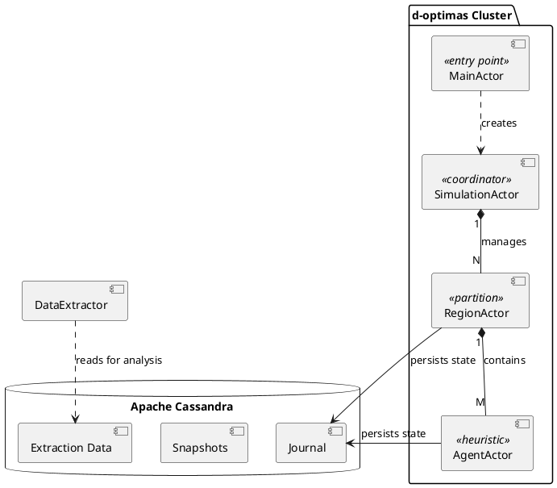
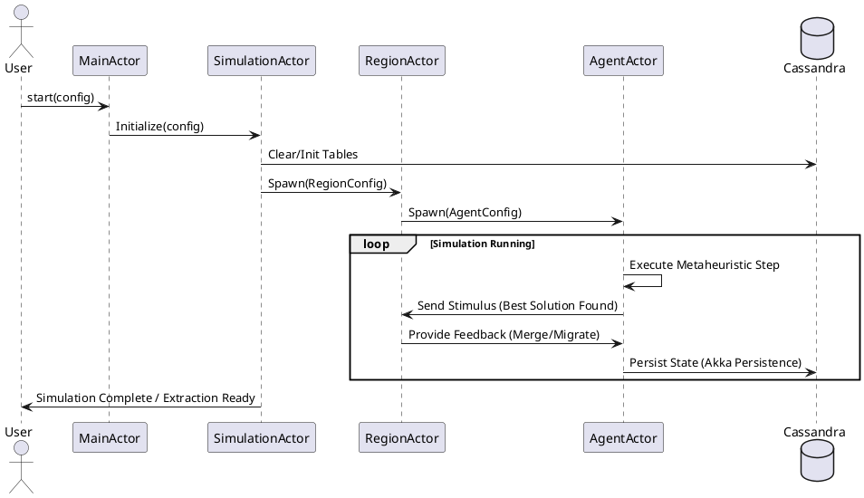

# d-optimas Architecture Overview

**d-optimas** is a distributed optimization framework that leverages the **Actor Model** to execute metaheuristics in a scalable and resilient manner. It is designed to solve complex optimization problems by partitioning the search space and enabling autonomous agents to cooperate or compete within those partitions.

---

## 1. High-Level Component Architecture

The system is built on top of the **Akka** toolkit. It follows a hierarchical actor structure where a simulation is decomposed into regions, and regions contain multiple agents.

### Component Diagram

---

## 2. Core Actors and Their Responsibilities

### `MainActor`
The entry point of the application. It receives a `SimulationSettings` object (parsed from HOCON configuration), initializes the database session, and spawns the `SimulationActor`.

### `SimulationActor`
Acts as the global coordinator for a specific simulation instance. It:
- Sets up the global problem definition.
- Spawns the required number of `RegionActors` across the cluster.
- Manages global termination criteria.

### `RegionActor`
Represents a specific "territory" or sub-space in the optimization problem. It:
- Manages the local pool of solutions.
- Coordinates interaction between agents (e.g., merging agents or exchanging best solutions).
- Acts as a communication hub for agents within its scope.

### `AgentActor`
The worker unit of the system. Each agent implements a specific metaheuristic (GA, PSO, ILS, etc.). It:
- Independently explores the search space.
- Communicates with its parent `RegionActor` to share findings or receive stimuli.
- Maintains its own internal state, which is periodically snapshotted to Cassandra.

---

## 3. Simulation Lifecycle

The following sequence diagram illustrates the initialization and interaction flow of a typical simulation.

### Sequence Diagram

---

## 4. Communication and Distribution

- **Akka Cluster & Remote:** d-optimas uses Akka Cluster to distribute actors across multiple JVM nodes. Communication between actors is location-transparent.
- **gRPC / Protocol Buffers:** High-performance serialization is used for message exchange, defined in `src/main/proto/doptimas.proto`.
- **Stimulus Model:** Interactions are modeled as "Stimuli" (Internal or External), allowing for a decoupled event-driven architecture.

---

## 5. Persistence and Data Extraction

d-optimas is "Offline-First" for analysis:
1. **Runtime:** Every significant state change in an agent or region is recorded as an event in **Apache Cassandra** using Akka Persistence.
2. **Post-Simulation:** The `DataExtractor` utility reads the raw events from Cassandra and transforms them into structured CSV or JSON files.
3. **Analysis:** Python scripts in the `analysis/` directory process these files to generate convergence plots, heatmaps, and performance metrics.

---

## 6. Benchmarking (COCO Integration)

For continuous optimization problems, d-optimas integrates the **COCO (Comparing Continuous Optimizers)** framework.
- **JNI Layer:** A native bridge (`native/`) allows Java code to call the optimized C implementation of COCO benchmarks.
- **BenchmarkActor:** A specialized actor that interface with the COCO JNI to provide objective function evaluations and logging in the standard COCO format.
